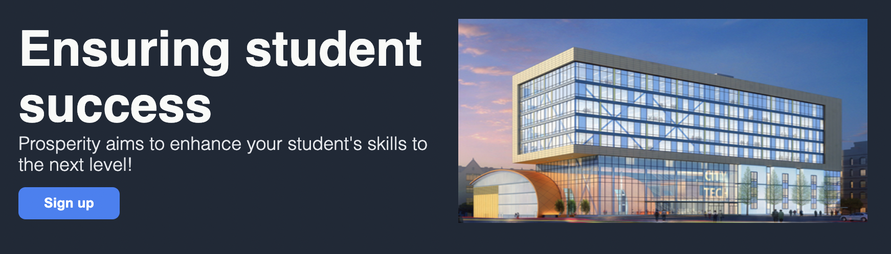

# landing-page
**Business company homepage**

A fictitious company (Prosperity) was used as a placeholder to fill in the website template created.

Website template built with Flexbox.

The webpage was split into 6 sections:

- header
- hero text section
- information section
- testimonial section
- call to action section
- footer

*References:*

- unity.png: New York City College of Technology
- watercolors.png: Freepik
- documents.png: Freepik
- sports.png: Jesus Chavarria
- technology.png: Eucalyp
